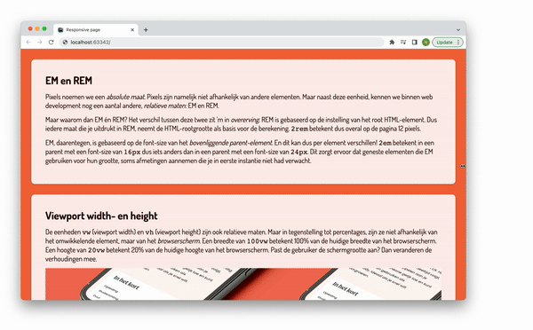

# Opdrachtomschrijving

Je gaat deze webpagina volledig responsive maken door gebruik te maken van root-sizes, relatieve maten (`rem` en `%`) en responsive afbeeldingen. Het eindresultaat zal er zo uit komen te zien:

Je kunt deze opdracht maken door het project te clonen of te downloaden naar jouw eigen computer via deze GitHub repository. De uitwerkingen staan op de branch _uitwerkingen_.

Het project bevat de volgende bestanden:
* `index.html` met daarin de tekst en elementen die je zult gaan voorzien van styling;
* `styles.css`: dit bestand is nog leeg;
* `assets` met daarin de afbeelding die je op de pagina in mag voegen.

## Opdrachtbeschrijving
1. Gebruik de kleuren uit [dit palet](https://coolors.co/f9c48b-f69051-f26d40-260803-fdefec) en zet deze alvast klaar in het CSS bestand, door ze als **CSS-variabelen** te declareren;
2. Voeg de belangrijke `<meta>`-tag toe aan het HTML-bestand;
3. Stel passende _root-font-sizes_ in voor mobiel, tablet en desktop door gebruik te maken van media-queries;
4. Zorg ervoor dat de achtergrondkleur van de body veranderd op basis van de schermgrootte. Geel op mobiel, oranje op tablets en rood op desktop;
5. Maak de sections en de tekst die erin staat zo op dat ze eruit zien als het voorbeeld. Houdt bij het gebruik van padding en margin rekening dat ook die afstanden afhankelijk moeten zijn van de root-font-size;
6. Voeg de afbeelding (`novi-responsive.png`) in tussen de tekst in de tweede section en zorg dat deze zich responsive gedraagt.